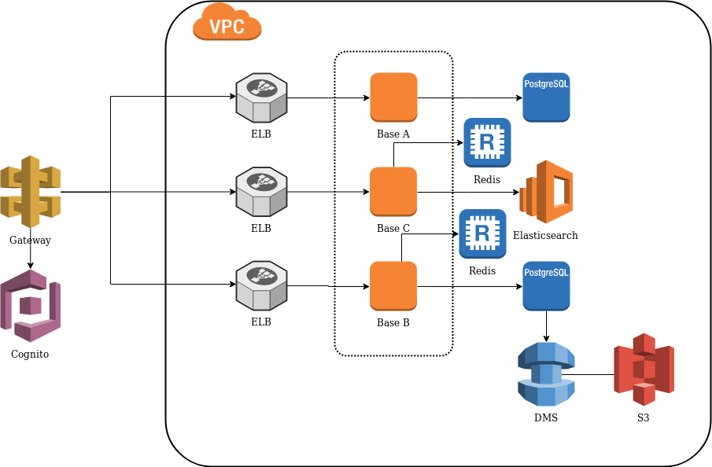

## Arquitetura:

    A arquitetura baseia-se na Amazon Web Services, que utiliza o Gateway para entrada das requisições passando por um Cognito que autentica o acesso. O resto dos componentes ficam dentro de uma Virtual Private Cloud que garante a segurança. Cada microserviço contém um Elastic Load Balancer que gerencia o balenceamento de carga entre as instâncias. Todos microserviços estão escritos em Python, a Base A utiliza um database PostgresSQL, a Base B utiliza um PostgreSQL com um Redis como cache e a Base C utiliza um Elasticsearch com Redis como cache. Os dados da Base B são extraídos pelo Data Migration Service que joga os dados em um S3 para a aplicação de machine learning processar. Para segurança os dados são criptografados ao serem salvos nos databases.

## Tecnologias utilizadas:
* [Python](https://www.python.org/)
* [Postgres](https://www.postgresql.org/)
* [Docker](https://www.docker.com/)
* [Redis](https://redis.io/)
* [Elasticsearch](https://www.elastic.co/pt/)
* [SqlAlchemy](https://www.sqlalchemy.org/)
* [Alembic](https://alembic.sqlalchemy.org/en/latest/)
* [Flask](https://palletsprojects.com/p/flask/)
* [Cryptography](https://cryptography.io/en/latest/)
* [Marshmallow](https://marshmallow.readthedocs.io/en/stable/)

## API'S Disponíveis:

* [Base A](https://github.com/lucianetedesco/foobar/wiki/API'S-Base-A)
* [Base B](https://github.com/lucianetedesco/foobar/wiki/API'S-Base-B)
* [Base C](https://github.com/lucianetedesco/foobar/wiki/API'S-Base-C)
